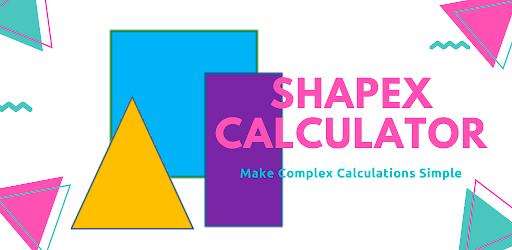

<a href="">
  

    
  

</a>

# 📐 ShapeX Calculator  

## 📌 Description
**ShapeX Calculator** is a **quick and easy-to-use** calculator application that eliminates all your **mathematical problems** related to **2D Geometry**. Whether you're a **student, teacher, or professional**, this app helps you compute geometric parameters **instantly and accurately**.

No need to **memorize formulas** or manually show working steps—**ShapeX Calculator does it all for you!**  

---

## 🚀 Features

### 📊 **Quick and Easy 2D Shape Calculator**
- Instantly compute **Length, Width, Area, Perimeter, Diagonal, Base, Height, Radius, Diameter, Circumference** for multiple **2D shapes**.
- Supports various **geometric figures**, including:
  - **Circle**
  - **Triangle (Equilateral & Isosceles)**
  - **Square**
  - **Rectangle**
  - *(More shapes coming soon!)*

### 📝 **Detailed Calculations & Working**
- **Step-by-step working** for all calculations with a single tap.
- **Perfect for tests and assignments**, ensuring clarity in problem-solving.

### 🔢 **Flexible Decimal Precision**
- Customize the **number of decimal places** to round your answer.

### 📖 **Built-in Formula Reference**
- View **relevant formulas** for each shape **instantly**.
- **No need to memorize**—just tap and learn.

### 🌍 **Wikipedia Integration**
- Each shape comes with a **direct link to an article**, providing **detailed explanations** and background.

### ✅ **User-Friendly & Time-Saving**
- **Minimal input required** for fast and accurate results.
- **Ideal for students, teachers, and professionals** handling geometry.

---

## 🏗️ Technologies Used

- **Android Studio** – Official IDE for Android app development.
- **Java** – Core programming language for smooth and efficient calculations.
- **XML** – UI design and layout.
- **Google Play Store** – Available for **free download** on Android devices.

---
